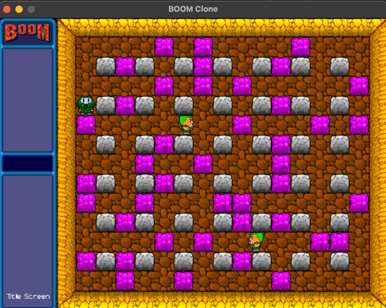

# Boom Clone

This repo is a way for me to experiment with Pygame, while _trying_ to recreate a classic MacOS game from my childhood.

Running the game
----------------

- `pip install requirements.txt`
- then run `python main.py`

This should open a new window (currently not resizable) :

Click `New Game` to start.

Press the `SPACE` bar to place a bomb. You can explode all pink blocks, but you can't kill enemies, and
enemies currently cannot hit you either!
Click `Title Screen` to go back.

Main technologies
------------

- Python 3.10
- Pygame 2.1.2

Next steps
----------

- enemies can shoot bullets
- HUD
- Player can pick up coins
- soundtrack

I'm using conventional commits (see reference [here](https://www.conventionalcommits.org/en/v1.0.0/)).
