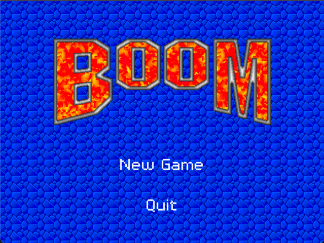

# Boom Clone

This repo is a way for me to experiment with Pygame, while _trying_ to recreate a classic MacOS game from my childhood.

Running the game
----------------

- `pip install requirements.txt`
- then run `python main.py`

This should open a new window (currently not resizable) :

Click "New Game" to start. But right now there is no game to play :grimacing:

Main technologies
------------

- Python 3.10
- Pygame 2.1.2

Next steps
----------

- enemies
- coins
- soundtrack

I'm using conventional commits (see reference [here](https://www.conventionalcommits.org/en/v1.0.0/)).
